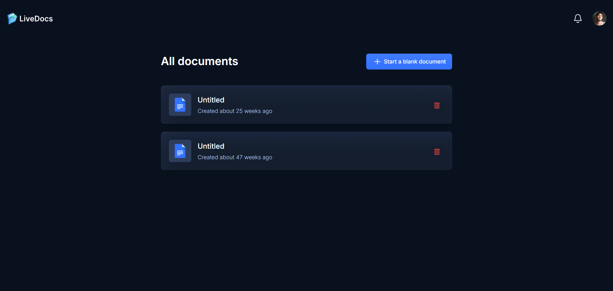
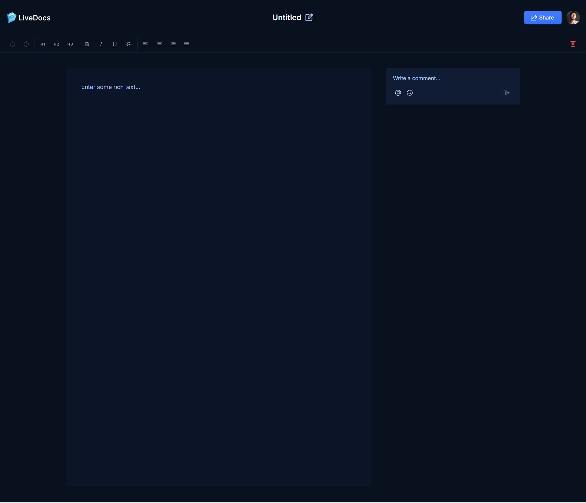
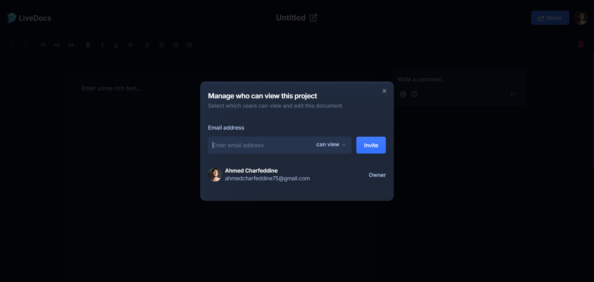
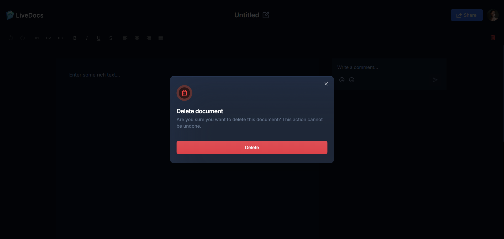

# LiveDocs ✍️

A real-time collaborative document editing platform built with **Next.js**, **Socket.IO**, and **MongoDB**.

## 🚀 Features

- 🧑‍💻 **Real-Time Collaboration** — Multiple users can edit the same document simultaneously
- 🔐 **Authentication** — Secure sign in/sign up using [Clerk](https://clerk.dev)
- 📝 **Document CRUD** — Create, update, and delete documents with persistent storage
- 🌐 **Responsive Design** — Works seamlessly across devices
- ⚡ **Socket.IO Integration** — Lightning-fast sync for all users editing a document

## 🛠️ Tech Stack

- **Frontend:** Next.js, TypeScript, Tailwind CSS
- **Backend:** Node.js (via Next API routes), Socket.IO, Mongoose
- **Auth:** Clerk.dev
- **Database:** MongoDB
- **Deployment:** [Vercel](https://vercel.com)

## 📸 Screenshots





## 📦 Installation

```bash
git clone https://github.com/ahmedcharfeddine013/live_docs.git
cd live_docs
npm install
